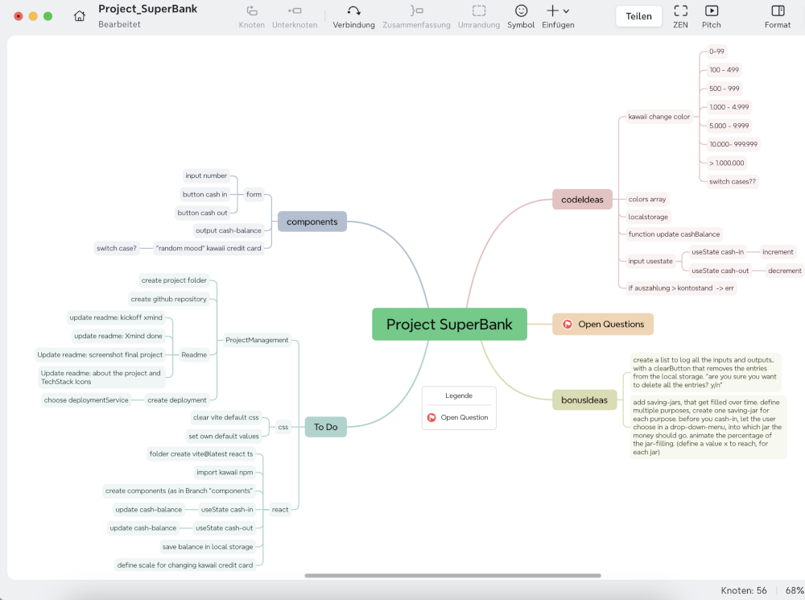
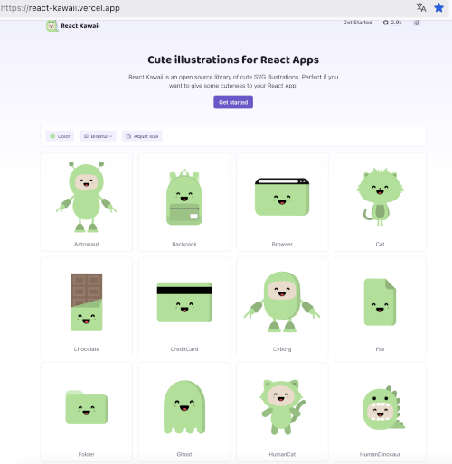

Huhu,
welcome to my lovely SuperBank Project.
I´m new to React and codeWriting in general, so with todays Project, we practice.

* Built a WebBank
* UserInput Field to set any amount
* UserChoice Buttons to cash-in or cash-out
* Output for the new Cash-Balance
* Implement npm "React-kawaii TS"  (a set of kawaii SVG Illustrations. Planets, CreditCards, Planet Browser. see below - i included a visual overview and the links)
* Depending on the current cash-balance, the kawaii credit card changes it´s appearance. (mood/color)
* 👾 get familiar with Reacts { useState }

### what the project should/could look like, according to the given Exercise.


___________________________

### what the Nini-Project looks like at cashbalance 0 and cashbalance >= 1.000.000

___________________________

### how i did it
with my former experience as ProductManager for a HR-Software and ProjectManager, i blew up the project, bigger then its scope "allows" so far, but... 

## First Steps 👾🍀
Usually, when i get an exercise/inspiration, my brain shoots into a gazillion branches and directions.

So I jump into my MindMap Tool (Xmind) and visualise said Branches. 🧚🏼‍♀️

This XMind is the Navigation /toDoList / ProjectMap.
That´s how we get from start to finish.  kickoff. let´s fetz

### 🍀 Xmind Overview 👾KICKOFF 👾


### 🍀 Xmind Overview 👾IT WORKS <3 👾


### The React - Kawaii SVG Collection we used



[link to the package](https://www.npmjs.com/package/react-kawaii) 

[link to the documentation](https://react-kawaii.vercel.app/) 


## ProjectStatus: it works. card changes mood and color.
next additional steps:
-save cashBalance in local storage
-decide on a deployment service (own repo for the project, then deploy)


## (not mine- Initial Standard Filling of the Readme:)


### React + TypeScript + Vite

This template provides a minimal setup to get React working in Vite with HMR and some ESLint rules.

Currently, two official plugins are available:

- [@vitejs/plugin-react](https://github.com/vitejs/vite-plugin-react/blob/main/packages/plugin-react/README.md) uses [Babel](https://babeljs.io/) for Fast Refresh
- [@vitejs/plugin-react-swc](https://github.com/vitejs/vite-plugin-react-swc) uses [SWC](https://swc.rs/) for Fast Refresh

## Expanding the ESLint configuration

If you are developing a production application, we recommend updating the configuration to enable type-aware lint rules:

```js
export default tseslint.config({
  extends: [
    // Remove ...tseslint.configs.recommended and replace with this
    ...tseslint.configs.recommendedTypeChecked,
    // Alternatively, use this for stricter rules
    ...tseslint.configs.strictTypeChecked,
    // Optionally, add this for stylistic rules
    ...tseslint.configs.stylisticTypeChecked,
  ],
  languageOptions: {
    // other options...
    parserOptions: {
      project: ['./tsconfig.node.json', './tsconfig.app.json'],
      tsconfigRootDir: import.meta.dirname,
    },
  },
})
```

You can also install [eslint-plugin-react-x](https://github.com/Rel1cx/eslint-react/tree/main/packages/plugins/eslint-plugin-react-x) and [eslint-plugin-react-dom](https://github.com/Rel1cx/eslint-react/tree/main/packages/plugins/eslint-plugin-react-dom) for React-specific lint rules:

```js
// eslint.config.js
import reactX from 'eslint-plugin-react-x'
import reactDom from 'eslint-plugin-react-dom'

export default tseslint.config({
  plugins: {
    // Add the react-x and react-dom plugins
    'react-x': reactX,
    'react-dom': reactDom,
  },
  rules: {
    // other rules...
    // Enable its recommended typescript rules
    ...reactX.configs['recommended-typescript'].rules,
    ...reactDom.configs.recommended.rules,
  },
})
```
# SuperBank
